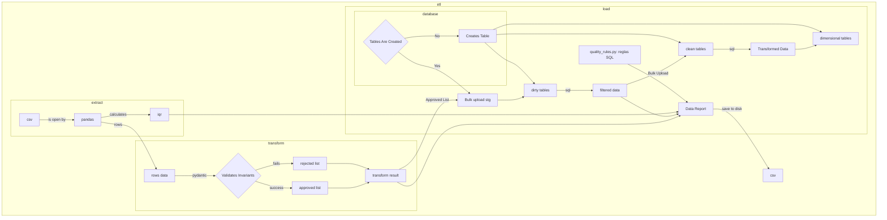

# ETL process

```mermaid
flowchart TD
    subgraph etl_process ["etl"]
        subgraph extract_step["extract"]
            csv_files[csv] -->|is open by| pandas[pandas]
            pandas-->|calculates| iqr
        end
        subgraph transform_step["transform"]
            pandas --> |rows| rows_data["rows data"]
            rows_data -->|pydantic| pydantic{Validates Invariants}
            pydantic -->|success| approved_list[approved list]
            pydantic -->|fails| rejected_list[rejected list]
            transform_res[transform result]
            approved_list -->transform_res
            rejected_list --> transform_res

        end
        subgraph load_step["load"]
            subgraph db["database"]
                creates{Tables Are Created}
                creates -->|No| create_tables[Creates Table]


            end
            stg_tables["dirty tables"]
            clean_tables["clean tables"]
            dim_tables["dimensional tables"]
            bulk_up_stg["Bulk upload stg"]
            bulk_up_stg --> stg_tables
            transform_res -->|Approved List| bulk_up_stg
            stg_tables --> |sql| filtered_data[filtered data]
            filtered_data --> |Bulk Upload | clean_tables
            clean_tables --> |sql| transformed[Transformed Data]
            transformed --> dim_tables
            create_tables -->stg_tables
            create_tables -->clean_tables
            create_tables --> dim_tables
            creates -->|Yes| bulk_up_stg

            report[Data Report]
            transform_res-->report
            filtered_data-->report
            iqr --> report
            rules[quality_rules.py: reglas SQL] --> report


        end
        report -->|save to disk| csv
    end

```
