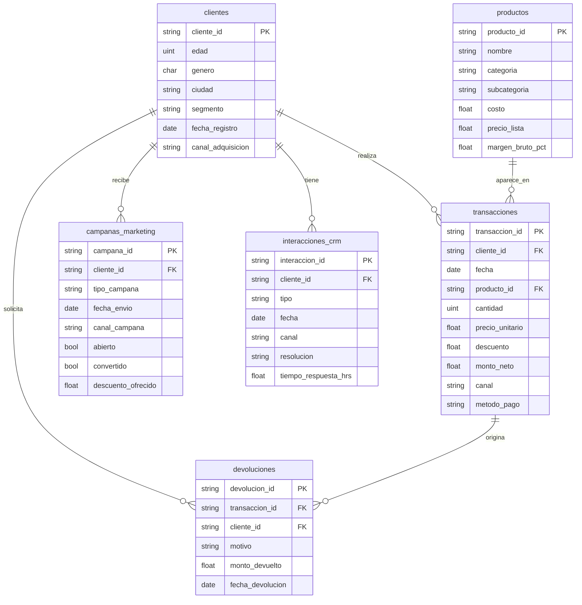

# Diagrama ER de los CSV

```mermaid
erDiagram
    clientes {
        string cliente_id PK
        uint   edad
        char   genero
        string ciudad
        string segmento
        date   fecha_registro
        string canal_adquisicion
    }

    productos {
        string producto_id PK
        string nombre
        string categoria
        string subcategoria
        float  costo
        float  precio_lista
        float  margen_bruto_pct
    }

    transacciones {
        string transaccion_id PK
        string cliente_id FK
        date   fecha
        string producto_id FK
        uint   cantidad
        float  precio_unitario
        float  descuento
        float  monto_neto
        string canal
        string metodo_pago
    }

    campanas_marketing {
        string campana_id PK
        string cliente_id FK
        string tipo_campana
        date   fecha_envio
        string canal_campana
        bool   abierto
        bool   convertido
        float  descuento_ofrecido
    }

    interacciones_crm {
        string interaccion_id PK
        string cliente_id FK
        string tipo
        date   fecha
        string canal
        string resolucion
        float  tiempo_respuesta_hrs
    }

    devoluciones {
        string devolucion_id PK
        string transaccion_id FK
        string cliente_id FK
        string motivo
        float  monto_devuelto
        date   fecha_devolucion
    }

    clientes ||--o{ transacciones : "realiza"
    clientes ||--o{ campanas_marketing : "recibe"
    clientes ||--o{ interacciones_crm : "tiene"
    clientes ||--o{ devoluciones : "solicita"

    productos ||--o{ transacciones : "aparece_en"

    transacciones ||--o{ devoluciones : "origina"
```
