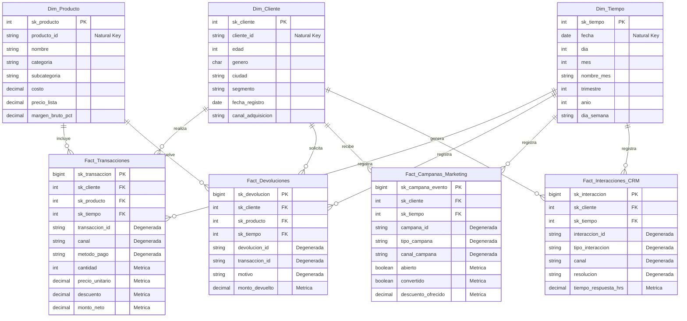
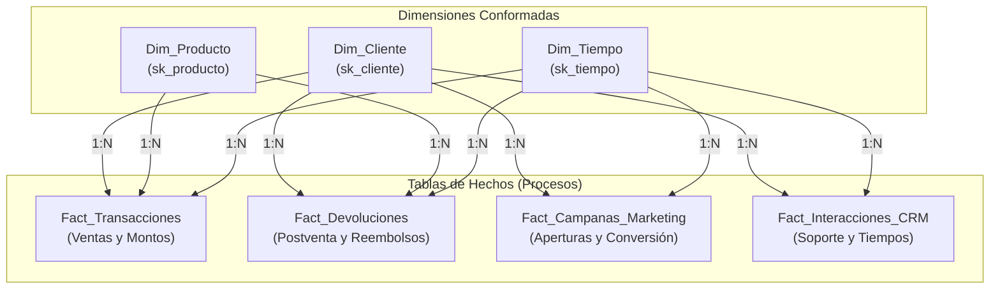

```mermaid
erDiagram
    Dim_Cliente {
        int sk_cliente PK
        string cliente_id "Natural Key"
        int edad
        char genero
        string ciudad
        string segmento
        date fecha_registro
        string canal_adquisicion
    }

    Dim_Producto {
        int sk_producto PK
        string producto_id "Natural Key"
        string nombre
        string categoria
        string subcategoria
        decimal costo
        decimal precio_lista
        decimal margen_bruto_pct
    }

    Dim_Tiempo {
        int sk_tiempo PK
        date fecha "Natural Key"
        int dia
        int mes
        string nombre_mes
        int trimestre
        int anio
        string dia_semana
    }

    Fact_Transacciones {
        bigint sk_transaccion PK
        int sk_cliente FK
        int sk_producto FK
        int sk_tiempo FK
        string transaccion_id "Degenerada"
        string canal "Degenerada"
        string metodo_pago "Degenerada"
        int cantidad "Metrica"
        decimal precio_unitario "Metrica"
        decimal descuento "Metrica"
        decimal monto_neto "Metrica"
    }

    Fact_Devoluciones {
        bigint sk_devolucion PK
        int sk_cliente FK
        int sk_producto FK
        int sk_tiempo FK
        string devolucion_id "Degenerada"
        string transaccion_id "Degenerada"
        string motivo "Degenerada"
        decimal monto_devuelto "Metrica"
    }

    Fact_Campanas_Marketing {
        bigint sk_campana_evento PK
        int sk_cliente FK
        int sk_tiempo FK
        string campana_id "Degenerada"
        string tipo_campana "Degenerada"
        string canal_campana "Degenerada"
        boolean abierto "Metrica"
        boolean convertido "Metrica"
        decimal descuento_ofrecido "Metrica"
    }

    Fact_Interacciones_CRM {
        bigint sk_interaccion PK
        int sk_cliente FK
        int sk_tiempo FK
        string interaccion_id "Degenerada"
        string tipo_interaccion "Degenerada"
        string canal "Degenerada"
        string resolucion "Degenerada"
        decimal tiempo_respuesta_hrs "Metrica"
    }

    Dim_Cliente ||--o{ Fact_Transacciones : realiza
    Dim_Producto ||--o{ Fact_Transacciones : incluye
    Dim_Tiempo ||--o{ Fact_Transacciones : registra

    Dim_Cliente ||--o{ Fact_Devoluciones : solicita
    Dim_Producto ||--o{ Fact_Devoluciones : devuelve
    Dim_Tiempo ||--o{ Fact_Devoluciones : registra

    Dim_Cliente ||--o{ Fact_Campanas_Marketing : recibe
    Dim_Tiempo ||--o{ Fact_Campanas_Marketing : registra

    Dim_Cliente ||--o{ Fact_Interacciones_CRM : genera
    Dim_Tiempo ||--o{ Fact_Interacciones_CRM : registra
```

```mermaid
flowchart TD
    subgraph DIMENSIONES["Dimensiones Conformadas"]
        C["Dim_Cliente<br/>(sk_cliente)"]
        P["Dim_Producto<br/>(sk_producto)"]
        T["Dim_Tiempo<br/>(sk_tiempo)"]
    end

    subgraph HECHOS["Tablas de Hechos (Procesos)"]
        FT["Fact_Transacciones<br/>(Ventas y Montos)"]
        FD["Fact_Devoluciones<br/>(Postventa y Reembolsos)"]
        FC["Fact_Campanas_Marketing<br/>(Aperturas y Conversión)"]
        FI["Fact_Interacciones_CRM<br/>(Soporte y Tiempos)"]
    end

    C -->|1:N| FT
    P -->|1:N| FT
    T -->|1:N| FT

    C -->|1:N| FD
    P -->|1:N| FD
    T -->|1:N| FD

    C -->|1:N| FC
    T -->|1:N| FC

    C -->|1:N| FI
    T -->|1:N| FI
```
